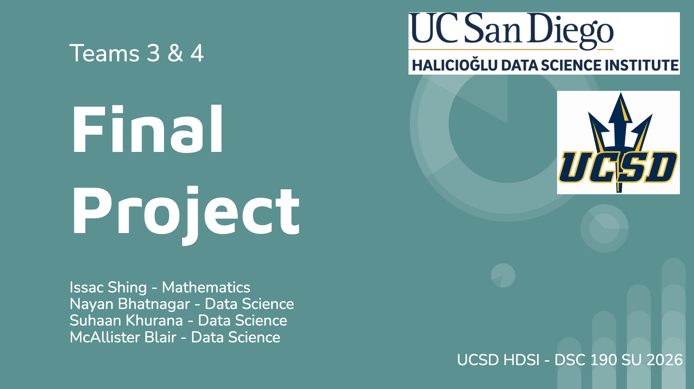
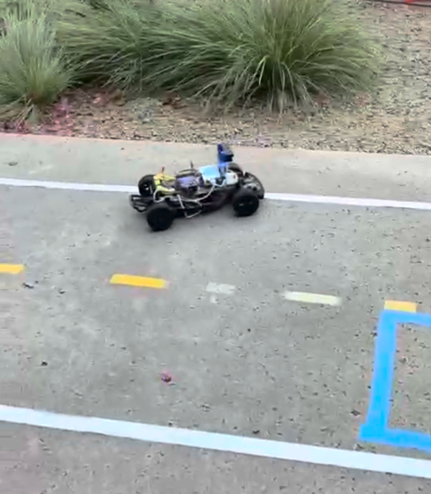
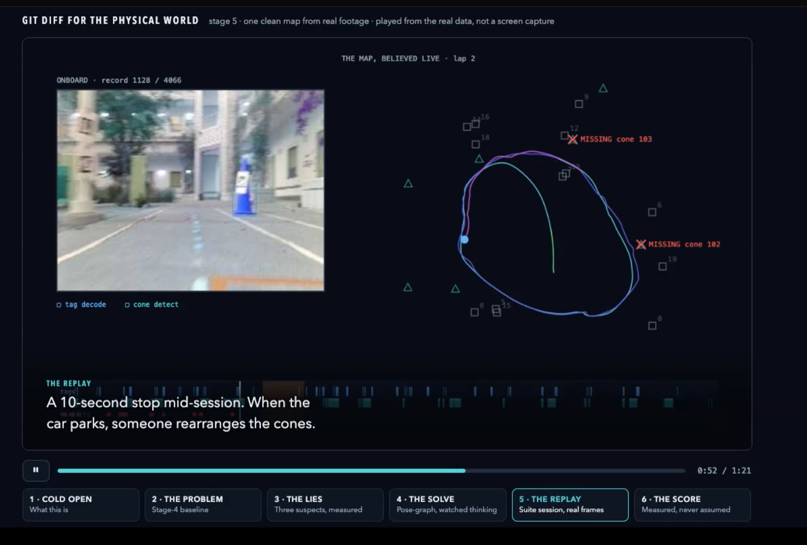

# Robust Autonomous Lane Following and Virtual Mapping

### DSC 190, Summer I 2026, Teams 3 & 4
#### Team Members: Issac Shing, Nayan Bhatnagar, Suhaan Khurana, McAllister Blair

## Overview
This project aims to both enhance DonkeyCar's default line follower algorithm, and also to use data to make a virtual map out of data which can detect changes in landmarks. The default line follower algorithm has a fixed range for what it considers to be yellow pixels, and just finds the column with the most yellow pixels, using that column to adjust steering. This simple algorithm can't account for changes in lighting, causing the yellow to appear different during different times of day, and can't deal with losing the line temporarily while often getting distracted by yellow pixels in the background. We updated the algorithm to account for these and added new features, such as being able to reverse if the line is completely lost, and also stopping completely if an orange cone is blocking the way.

Then, data was collected where AprilTags and cones were displayed but then constantly moved around while the car was driving and recording. This data was used to map out the approximate position of the car and create a virtual map which was able to find which objects had been moved and to where. Also, a virtual environment was set up with customizable tracks and movable virtual landmarks which could be detected as well.

## What We Promised

### Must Haves
- Cropping the top part of images to emphasize the lower half where the track is
- Improving the robustness of the line follower algorithm
- Creating a virtual map with landmarks (such as AprilTags)
- Autonomous driving of the virtual map
- Being able to detect changes in the map as landmarks move

### Nice to Haves
- A self-healing map which updates when changes are detected
- Using a second car as a survey vehicle to autonomously generate the map
- Going tag-free by using YOLO that is trained to detect cones

## What We Achieved

#### Made Line Follower More Robust, So It:
- Automatically crops a certain percentage of the top part of images
- Changes the color range for yellow pixels to be relative to the median brightness of the tile it is in
- Finds the shape for clusters of yellow pixels and ignores the ones not shaped like a line
- Tries to find the line near to where it last saw it before searching the entire frame
- Lowers speed when confidence is less, and slowly stops and reverses when it can’t find the line
- Completely stops when detecting a cone blocking the track, and continues moving when it no longer detects it

#### Created a Virtual Map Which Can Detect Changes:
- Recorded data using landmarks such as AprilTags and cones, and moved them around while the car was driving
- Created a virtual map out of that data which predicts the location of the car for any given frame
- Map can detect objects that become missing, are moved, or are newly added

## Problems We Faced
- Line follower didn’t work initially since line colors were inverted at first, so it saw a blue line but was looking for a yellow one
- The bushes in the background were interfering with line follower, so we increased the crop level to crop most of the top part of images
- Lots of hardware issues made it difficult to test our code, and we never got both our cars working at the same time

## Slides and Demos

[](https://docs.google.com/presentation/d/1oK7fLTyPAr--vHwtMTxm-tAYWlavO5QTy0bWs794gaA/edit?usp=sharing)

[](https://drive.google.com/file/d/1qwJIO8I5Wxn8G2dugmhGZfUJsR8IytMS/view?usp=sharing)

[](https://drive.google.com/file/d/1u4GHUNSSmy5oSDKYHqRDT6nt5pxpSvcE/view?usp=sharing)

## Documentation

The more robust line follower we built lives at , while the modified version with auto-reversing and cone stopping is at .

In order to activate them, go to , and add this for the basic line follower:
```
CV_CONTROLLER_MODULE = "linefollower_histogram_geo_filter"
CV_CONTROLLER_CLASS = "HybridLineFollower"
```
or add this for the one with extra features:
```
CV_CONTROLLER_MODULE = "linefollower_cone_reverse"
CV_CONTROLLER_CLASS = "ConeReverseLineFollower"
```

---

## Contacts
- Issac Shing: ishing@ucsd.edu
- Nayan Bhatnagar: nbhatnagar@ucsd.edu
- Suhaan Khurana: sukhurana@ucsd.edu
- McAllister Blair: mpblair@ucsd.edu
